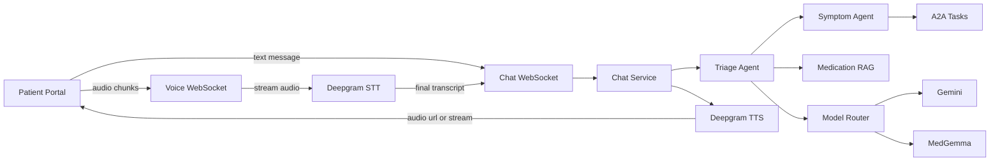

# Phase 5 Chat And Voice Design

## Purpose

Phase 5 makes the patient chat experience production ready across text, voice, document context, symptom triage, medication education, multilingual support, and safety escalation.

This document reconciles the current code with the remaining work and defines the implementation path. The implementation should be shipped as small pull requests, not as one large change.

## Current State

### Solid foundation

- Backend chat WebSocket exists at `/ws/chat/{patient_id}`.
- Chat messages persist to `chat_messages`.
- Conversation state persists with optimistic conflict handling.
- Patient context is loaded from medications, conditions, symptoms, and optional document data.
- Triage agent handles intent, urgency, safety copy, bilingual responses, and symptom routing.
- Symptom agent extracts symptom data and writes `symptom_reports`.
- A2A task lifecycle exists for symptom to pharmacovigilance delegation, including idempotency, retry, backoff, and dead-letter state.
- Patient portal chat UI supports message bubbles, streaming assistant drafts, language selector, quick prompts, document-context banner, Records to Chat context handoff, and browser voice fallback.

### Main gaps

- Medication and document questions need stronger grounding with document context and RAG citations.
- Voice is currently browser Web Speech API only. The production path must use Deepgram STT and TTS through the backend.
- Medical RAG is not implemented.
- Symptom agent golden conversations are missing.
- Voice pipeline tests are missing.
- A2A worker topology, multi-worker safety, and observability remain production hardening follow-ups.

## Architecture

## Model Routing

### Gemini default

Use Gemini for patient-facing chat by default:

- General health education.
- Plain-language explanations.
- Document and medication answers after grounding.
- Multilingual user-facing responses.
- Scheduling and general support intents.
- Summaries and conversational follow-up copy.

Gemini should use structured output where the backend needs reliable fields, such as intent, urgency, language, tool route, and safety flags.

### MedGemma constrained use

Use MedGemma only where medical-specialized comprehension or extraction is required and the output is treated as preliminary:

- Medical document understanding.
- EHR-like context comprehension.
- Structured symptom or ADR interpretation.
- Pharmacovigilance support.
- Clinical extraction benchmarks where MedGemma has already been selected.

Do not use MedGemma output directly as patient-facing diagnosis, treatment recommendation, or patient-management advice. The model card states that MedGemma is intended as a developer starting point and that outputs are preliminary and require independent verification.

### Deepgram speech layer

Use Deepgram for speech, not for medical reasoning:

- Streaming STT for voice input.
- TTS for assistant audio responses.
- Browser voice stays as a fallback when backend voice is unavailable.

This keeps medical safety, chat state, patient context, A2A events, RAG, and model routing inside our backend.

## Multilingual Policy

Initial supported production languages:

- English.
- Spanish.

Design the interfaces so more languages can be added without changing the chat protocol.

Rules:

- Normalize all user-selected or detected language values through shared locale helpers.
- Respond in the same language as the user unless the user changes language.
- Keep safety escalation copy localized.
- Persist `language` on chat messages.
- For voice, map locale to STT and TTS model options. If Deepgram TTS does not support a selected language well enough, fall back to text plus browser synthesis where available.
- Never translate medication names, drug labels, or cited source titles unless a source explicitly provides localized content.

## Safety Policy

Patient-facing chat must:

- Avoid diagnosis.
- Avoid medication changes, stopping medications, or dosing changes without clinician direction.
- Escalate emergency and urgent symptoms clearly.
- Notify assigned clinicians when configured.
- Make uncertainty explicit.
- Prefer citations for medication education and document-grounded answers.
- Separate escalation messages from generic transport or chat errors in the UI.

## Implementation Pull Requests

### PR 1: Design, tracker reconciliation, and document-aware chat

Scope:

- Add this design document.
- Update `TASKS.md` to track the implementation sequence.
- Complete the Records to Chat document context handoff by passing `context=doc:<id>` to the backend WebSocket.
- Handle backend `chat_context_loaded` events in the patient portal.
- Do not claim unrelated unchecked work is complete.

Validation:

- Markdown review.
- Confirm tasks match code audit.
- Focused patient portal chat tests and lint checks.

### PR 2: Chat quality, safety, and multilingual UX

Scope:

- Strengthen routing for symptom, medication question, schedule, document question, urgent, and general intents.
- Improve prompt structure and response contracts.
- Improve UI handling for escalation versus errors.
- Harden multilingual behavior.

Key files:

- `backend/src/app/agents/triage/graph.py`
- `backend/src/app/agents/triage/prompts.py`
- `backend/src/app/agents/symptom/graph.py`
- `apps/patient-portal/src/app/(app)/chat/page.tsx`
- `apps/patient-portal/src/content/chat-copy.ts`

Tests:

- Multilingual chat cases.
- Urgent and emergency escalation cases.
- Medication and document question cases.
- Symptom follow-up cases.

### PR 3: Medication RAG foundation

Scope:

- Add pgvector-backed medication knowledge chunks.
- Ingest curated DailyMed and RxNorm content.
- Add embedding generation.
- Retrieve relevant chunks for medication questions.
- Include citations in chat responses.
- Add safe fallback when retrieval is weak.

Likely files:

- `backend/src/app/db/migrations/*_drug_knowledge_rag.sql`
- `backend/src/app/services/dailymed_service.py`
- `backend/src/app/services/rxnorm_service.py`
- `backend/src/app/services/drug_knowledge_service.py`
- `backend/src/app/agents/triage/graph.py`

Tests:

- Chunk ingestion.
- Retrieval ranking.
- Citation inclusion.
- No-answer fallback.

### PR 4: Deepgram voice pipeline

Scope:

- Add backend voice WebSocket.
- Stream patient audio to Deepgram STT.
- Feed final transcript into the same chat orchestration path as text.
- Generate assistant audio with Deepgram TTS.
- Store audio in Supabase Storage where needed.
- Preserve browser voice fallback.

Key files:

- `backend/src/app/clients/deepgram_client.py`
- `backend/src/app/routers/chat.py` or a new voice router.
- `apps/patient-portal/src/services/browser-voice.ts`
- `apps/patient-portal/src/hooks/use-patient-chat-session.ts`

Tests:

- Mocked STT transcript flow.
- Mocked TTS generation flow.
- Voice message persistence.
- Language mapping.

### PR 5: Symptom agent golden set and A2A confidence

Scope:

- Add at least 10 symptom conversation fixtures.
- Validate follow-up questions, structured symptom reports, urgency, ADR flags, and A2A events.
- Confirm idempotency per symptom event.

Tests:

- Golden symptom conversations.
- A2A lifecycle from chat-triggered symptom report.
- Retry and dead-letter behavior stays covered.

### PR 6: Final docs and Phase 5 closure

Scope:

- Update `TASKS.md` checkboxes only for verified implementation.
- Update env examples for any new voice, RAG, model, or storage settings.
- Update README and backend docs where endpoints, migrations, or manual steps changed.
- Document production smoke-test steps.

## Done Criteria

Phase 5 is complete when all of the following pass:

- Patient can ask text questions in English and Spanish.
- Patient can ask about a record and the backend uses the record context.
- Medication question responses use RAG citations or a safe fallback.
- Symptom conversations collect enough context before saving structured reports.
- Urgent symptoms trigger clear escalation flow.
- Voice input streams to STT, receives a transcript, routes through chat, and plays TTS.
- Chat messages and audio metadata persist.
- Symptom A2A lifecycle is visible and idempotent.
- Backend and patient portal tests pass.
- Deployed patient portal smoke test passes.

## References

- Deepgram Python SDK: https://github.com/deepgram/deepgram-python-sdk (last verified: 2026-04-29; archive backup: https://web.archive.org/web/*/https://github.com/deepgram/deepgram-python-sdk)
- Google Gen AI Python SDK: https://github.com/googleapis/python-genai (last verified: 2026-04-29; archive backup: https://web.archive.org/web/*/https://github.com/googleapis/python-genai)
- Vertex AI Model Garden: https://cloud.google.com/vertex-ai/docs (last verified: 2026-04-29; archive backup: https://web.archive.org/web/*/https://cloud.google.com/vertex-ai/docs)
- MedGemma model card: https://developers.google.com/health-ai-developer-foundations/medgemma/model-card (last verified: 2026-04-29; archive backup: https://web.archive.org/web/*/https://developers.google.com/health-ai-developer-foundations/medgemma/model-card)
